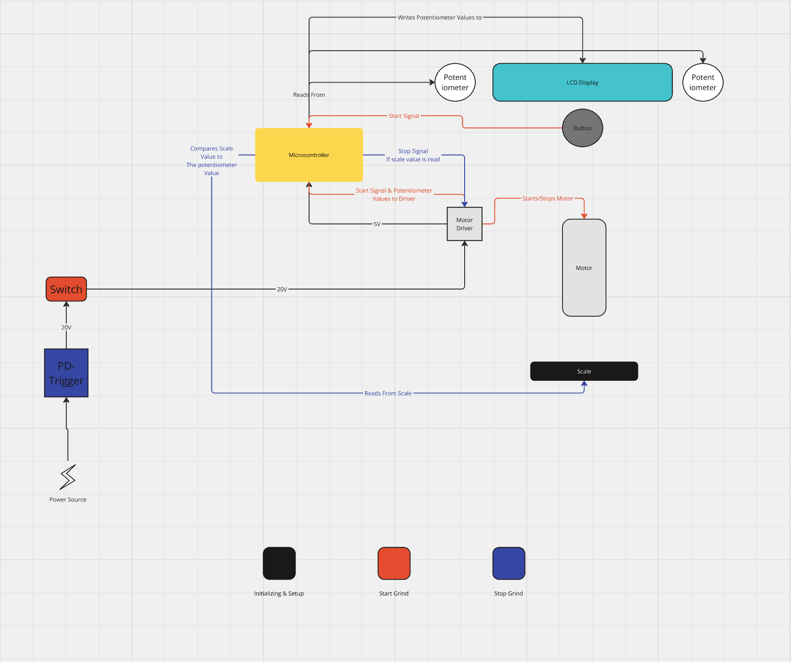

# Overview

This page will give you an overview over the different **Components** that you will start to understand along the process.
Those are the building blocks of the project, understanding each of those is key to build something like the **Grinduino!**

## Components

### USB-C Trigger Board
The USB-C Trigger board is responsible for providing the system with power. It has switches that you can flip to adjust the Voltage
that it will put out. This only works with a PD USB-C plug.

### Motor Driver
The motor driver acts like an **interface** for the **motor**, it can tell the motor, how fast it should spin and the direction.
It has some safety mechanism as well to protect the other parts from Voltage fluctuation that the Motor causes.
The Driver is directly connected to the **20V Power source** and it also has a Output terminal that has a output Voltage of 5V, this
is excellent to power the **Microcontroller** and to protect it from the higher voltage.

### Microcontroller 
This is the brain of the application. It processes signals from the other components and sends out signals to for example start the
Motor or Print something on the LCD Display. The Microcontroller, gets its power from the Motor Driver and then Distributes it to the 
other smaller components of the system.

### Potentiometer
The project has 2 potentiometers, those are little knobs that you can spin and adjust resistance. You can read those values with the 
**Microcontroller** and therefore use the potentiometers as input values. In our system we use the potentiometers to set the **RPM** and
the **Grind Dose**.

### Button
In our system we have a pressable button which is being read by the **Microcontroller**, if the button is pressed and the Motor is off,
the motor starts, if you press the button and the Motor is on, the motor stops.

### LCD Display
The LCD display works as an interface so the users can see the values that they are changing when spinning the **potentiometer**. 
What is being printed on the **LCD** decides the microcontroller.

### Scale
The scale in our system is being read by the **Microcontroller** during the Grind. It detects the ground coffee that falls into the 
Dosing Cup. The **Microcontroller** sends a stop signal to the Motor as soon as the Dose input value from the Potentiometer matches 
the output value from the Scale.

### Switch
There is also a **Switch** that can turn off the whole system if its not being used and the user doesn't want to have the LCD 
light on.

## Component Diagram

