# Software Architecture
This section will show you how the Code is being organized and how the different 
files work together to make the Grinduino project work.

## Code organization

The code is organized into classes, every component that needs logic, like the motor, buttons or the scale
have a class that we can call methods on. Those classes are being joined together in the Grinder class, 
which then is being called from the main file that executes the code.

```
Grinduino/
├── src/
│   ├──  main.cpp
├── lib/
│   └── motor/
│   |    └── motor.h
|   |    └──motor.cpp
|   |
│   └── button/
│       └── button.h
|       └── button.cpp
```

Every class has a .h file which defines the class, and a .cpp file which implements the class.

The code is being compiled into the .pio directory.

Since the code of the project is pretty small and its easy to keep track, there are no automated software tests.
The testing should be done on a hardware prototype to check if everything works as intendet.

## Data Flow



You can find explanatory texts inside the code files, try to understand the functions 

## Thats It!
Now you know how the project works on a higher level, yes it's really that simple!
If you have struggle to understand something, maybe ask a question in our [Discord Community](https://discord.gg/8UvV2dJnPF)
or you can try to dig deeper, sometimes you just need more details to understand something.
